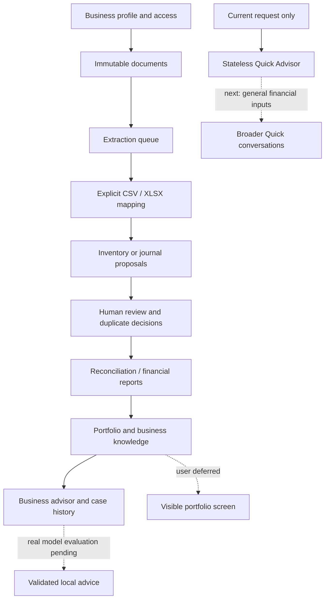

# Herman development map

Updated: **2026-10-11** · Active phase: **Backend workflows** · Latest checkpoint: **C10 — Journal imports**

**Now:** the structured document → reviewed journal → report → portfolio/advisor path works on synthetic data. The full PostgreSQL suite passes **195 tests**, with **one real-OCR fixture test skipped**. The product is still in development. **Next intended checkpoint:** make Quick Advisor useful for general financial questions without requiring inventory input or business history.

This map separates capabilities from acceptance gates. A verified checkpoint means its documented scope passed checks; it does not mean every feature in that segment is finished. There is no overall percentage because engine quality, operational readiness and deferred UI are different kinds of work.

## Workflow map

Solid paths exist in the backend within their documented bounds. Dashed paths show work or validation still outstanding. Advisors cannot approve or post financial records.

## Capability segments

| Segment | Working and verified scope | Remaining work / exit gate |
|---|---|---|
| S1 · Business foundation | Profiles, membership, tenant isolation, restricted database role, idempotent writes and audit events | Backup/restore and full application capacity. Existing 1,000-business benchmark covers synthetic reads only. |
| S2 · Evidence and review | Immutable uploads, queue recovery, CSV/XLSX extraction/mapping, row provenance, exact duplicate checks, human decisions | Three labeled real OCR invoices; semantic invoice matching; broader PDF/image table mapping. |
| S3 · Financial and inventory core | Recipes/consumption reconciliation; balanced journals, reversals, exact amounts, reviewed report mappings and cash-flow/KPI payloads | Inventory correction, closing controls, gross bank-flow classification, larger report batches and official accounting-standard verification. |
| S4 · Advisor and knowledge | Reviewed knowledge, bounded context, opt-in local drafts and immutable business-case history; isolated Quick inventory calculations | General financial Quick inputs, reviewed knowledge correction, actual local-model quality evaluation. |
| S5 · Owner experience | Earlier Persian RTL prototype; backend portfolio and five indicators | Visible business portfolio remains user-deferred. Licensed Kalameh assets are unavailable; Contour is planned for a later UI checkpoint. |
| S6 · Production validation | PostgreSQL regression tests, GitHub checks, evidence-preserving artifacts and local Graphify navigation | Restore drill, complete workload/capacity testing, real-engine acceptance and deployment hardening. |

## Checkpoint history

Tests listed below are historical full-suite results, not completion percentages or comparable measures of business value. They use synthetic inputs unless explicitly stated in [validation](VALIDATION.md).

| ID · Date | Capability gained | Full-suite evidence |
|---|---|---|
| C01 · Oct 05 | Local ingestion, ledger, ratios, forecasts and Persian prototype | 58 passed after the prototype follow-up; 1 skipped |
| C02 · Oct 05 | Multi-business inventory backend | [86 passed; 1 skipped](BACKEND_ACCEPTANCE.md) |
| C03 · Oct 06 | Durable extraction queue | [93 passed; 1 skipped](DOCUMENT_QUEUE.md) |
| C04 · Oct 06 | Inventory table imports and duplicate review | [108 passed; 1 skipped](TABULAR_IMPORTS.md) |
| C05 · Oct 08 | Reviewed knowledge and portfolio payloads | [122 passed; 1 skipped](ADVISOR_PORTFOLIO.md) |
| C06 · Oct 08 | Local advisor draft routes | [135 passed; 1 skipped](VALIDATION.md#local-advisor-draft-checkpoint--2026-10-08); a later added case passed in the focused suite |
| C07 · Oct 09 | Persistent business cases | [145 passed; 1 skipped](BUSINESS_CASES.md) |
| C08 · Oct 10 | Tenant journals and trial balance | [163 passed; 1 skipped](JOURNALS.md) |
| C09 · Oct 10 | Reviewed reports feeding portfolio/advisor | [174 passed; 1 skipped](JOURNAL_REPORTS.md) |
| **C10 · Oct 11** | **Document rows → atomic journal proposals → report lineage** | **[195 passed; 1 skipped](JOURNAL_IMPORTS.md)** |

Documentation-language, typography and Graphify checkpoints are supporting changes recorded in [validation](VALIDATION.md). They did not independently close a product capability gate.

## Current checkpoint: C10

Delivered: mapping preview, whole-voucher selection, explicit IRR/IRT and Gregorian/Jalali conversion, atomic multi-voucher import, duplicate row protection across identical file bytes, immutable line origins and provenance in report receipts. Imported entries remain pending until human review. The focused suite passed all **21** tests; the full suite passed **195**, with one real-OCR skip. Ruff and whitespace checks passed.

Evidence: [contract](JOURNAL_IMPORTS.md), [run record](../runs/journal-imports-2026-10-11/README.md), [tests](../tests/test_journal_imports.py), [migration](../src/backend/migration_012.sql), [technical report](../reports/journal-imports-2026-10-11_technical.md). Repository automation is visible in [GitHub checks](https://github.com/alisunkazemi21-cloud/Herman-SME-Financial-Advisor-Perisan/actions/workflows/tests.yml).

## Forward checkpoints and acceptance gates

These are intended work groups, not calendar promises. Each is complete only when its listed outcome has direct evidence.

| Next group | Expected outcome | Evidence needed to close it |
|---|---|---|
| N1 · General Quick Advisor | Financial questions and explicit request-only context without mandatory inventory data | No business/history retrieval or persistence; exact typed calculations where inputs suffice; missing/uncertain facts explicit; transport and isolation tests |
| N2 · Corrections and document understanding | Reviewed corrections to inventory/knowledge and broader duplicate/document handling | Append-only correction history, deterministic conflict resolution and realistic duplicate/non-duplicate fixtures |
| N3 · Operational and engine acceptance | Demonstrate the system's real operating limits and advice quality | Three labeled OCR invoices, actual local model evaluation, recoverable backup/restore and representative multi-business workloads |
| N4 · Owner-facing portfolio | Business overview, cash-flow diagram, indicators and knowledge highlights | Resume UI work with user direction; browser/accessibility checks, Persian typography and tested Contour integration |
| N5 · Accounting depth | Close/report controls and verified accounting rules | Authoritative standard versions, accountant-reviewed fixtures and independent expected results |

## Update rule

At each checkpoint, update the current/next marker, capability segments, historical result and evidence links. Keep unresolved gates visible. Record failure/recovery evidence in `VALIDATION.md`, preserve earlier receipts, and use the same milestone IDs in the run README, research chapter and technical report. The conversation visualization is a dated snapshot; this repository map is the maintained reference.
